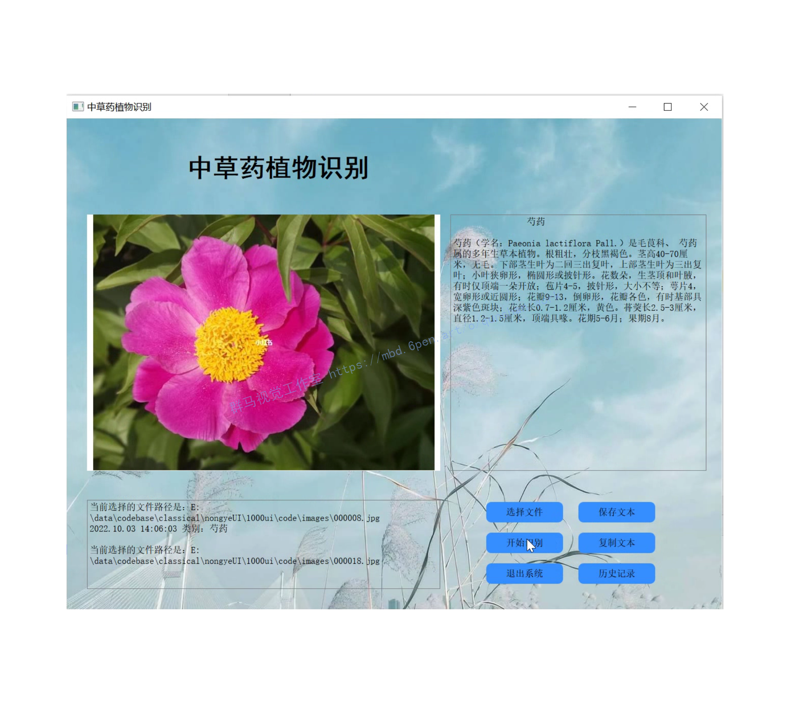
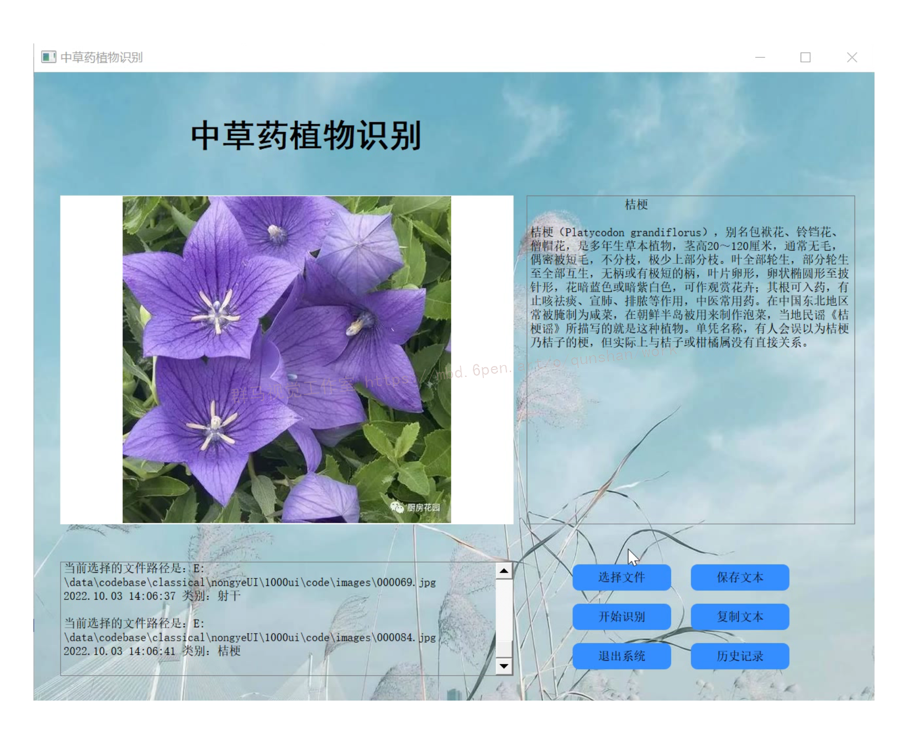
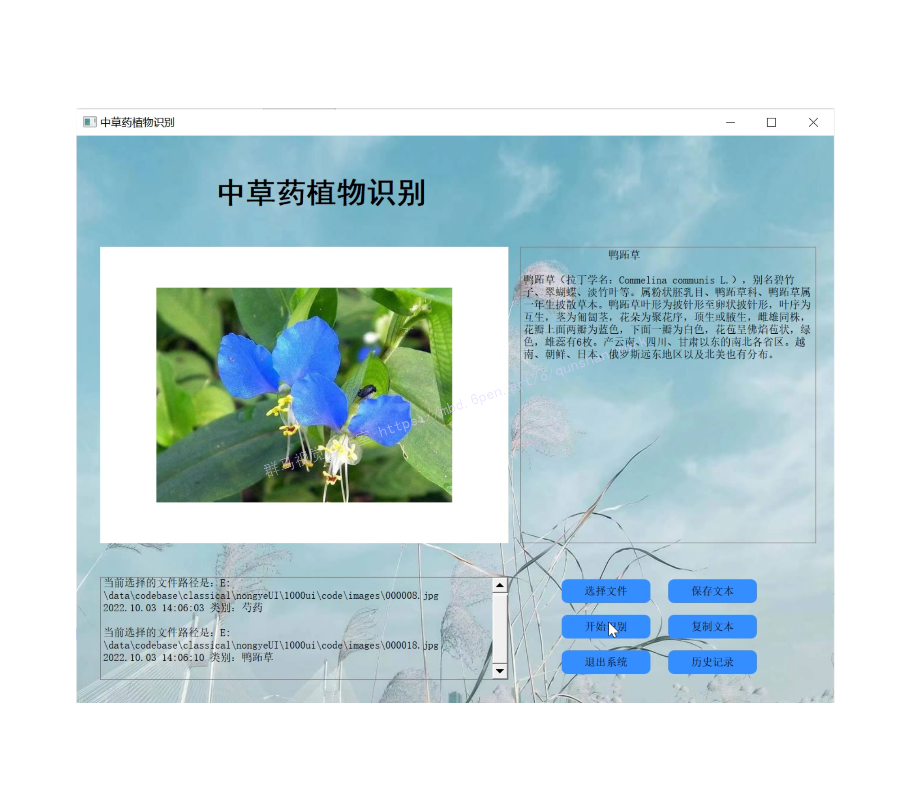
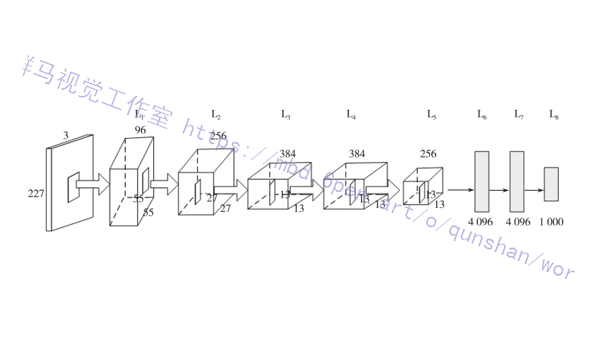
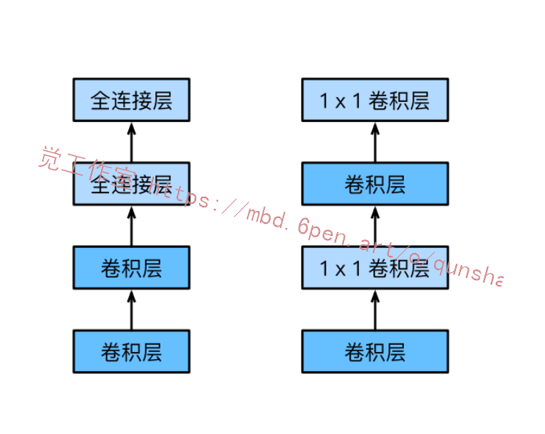
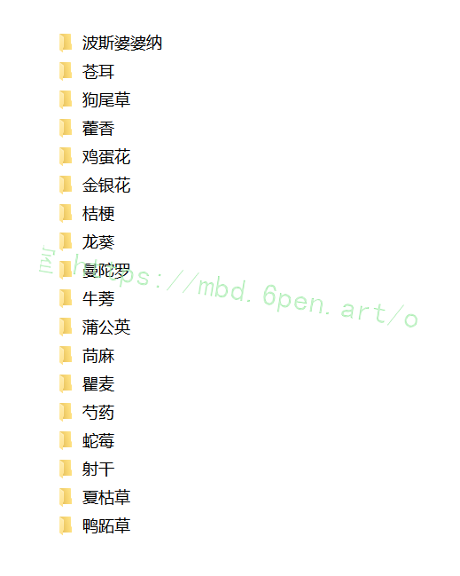
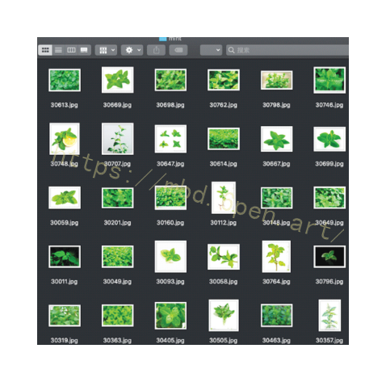
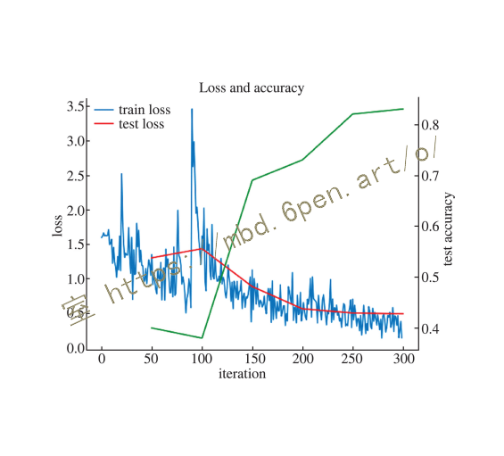

# 1.研究背景
传统的中草药图像识别往往需要人工采集大量的原始样本,再进行人工分析和研究，需要研究者具有相当丰富的中医药知识储备和经验,整个过程耗时耗力且识别率难以得到保证。随着信息技术的飞速发展,人工智能早已在图像识别领域崭露头角,将人工智能与祖国传统医药文化结合,可以为推动中医药信息化提供技术支持。谢宝剑"利用动态生长模型结合主动样本学习方法;姚明胜[2]以AdaboostLDA为分类算法,提取叶片几何特征;张帅[3]结合CNN 和SVM加以训练;忽胜强以植物叶片几何形状作为分类依据;李龙龙[5]将半监督算法应用到植物叶片识别中,以上这些方法均取得85%以上的识别准确率。
本项目在研究中草药植物图像分类过程中,借助人工智能算法的优势,开展基于深度神经网络的图像分类实验。借助AlexNet模型。在收集数据集时发现样本较小,训练的准确率较低,为此我们对原始样本进行了数据增扩,将样本容量提升4倍,构建了新的数据集,新数据集经迭代300次后分类准确率达到87.5% 。

# 2.图片演示






# 3.视频演示
[基于改进AlexNet的植物中草药分类系统（源码＆教程）_哔哩哔哩_bilibili](https://www.bilibili.com/video/BV12e4y1H7LY/?vd_source=bc9aec86d164b67a7004b996143742dc)


# 4.AlexNet 模型
AlexNet是由Krizhevsky 等人[6]创造并夺得 2012年 ImageNet比赛的冠军，将ImageNet 的识别准确率提高了一倍多。模型由8层结构组成,在图像分类上有自身较为出色的优势[7]。AlexNet的具体结构如图所示。


数据源输入格式为227×227×3,227表示输入图像的宽和高,3表示数据源为三通道RGB模式,因此支持常用格式的彩色图片,因此无需对采集的原始数据源进行额外的格式裁剪。本研究数据集均为JPG格式彩色图像。
前两层计算过程均为卷积(Conv ) 、ReLU、最大池化( max - pooling)及归一化( normal)。第二层输出的结果经过256个特征图进行卷积操作,其中 kernel _size为5、stride为1 ,其余参数同第一层。第三、第四层只进行了卷积和 ReLU操作。第五层同第一层的过程类似,区别在于没经过归一化处理。将第五层结果转换为长向量,输入到使用了三层全连接结构的传统神经网络中,其中前两个全连接层的 kernel分别为4 096。最后一层运用Softmax 回归函数即可得到分类(label)值。

# 5.网络的改进
①[参考该博客改进后的网络](https://mbd.pub/o/bread/Y5mTlJdr)包含8层变换，其中有5层卷积和2层全连接隐藏层，以及1个全连接输出层。
②AlexNet将sigmoid激活函数改成了更加简单的ReLU激活函数。
③AlexNet通过丢弃法来控制全连接层的模型复杂度。
④AlexNet引⼊了⼤量的图像增⼴，如翻转、裁剪和颜⾊变化，从⽽进⼀步扩⼤数据集来缓解过拟合。

#### 代码实现

```
import os
import torch
import torch.nn as nn
import sys
import time
import d2lzh_pytorch as d2l

os.environ["CUDA_VISIBLE_DEVICES"] = "0"
device = torch.device('cuda' if torch.cuda.is_available() else 'cpu')

print(torch.__version__)
print(device)
start = time.time()
class LeNet(nn.Module):
    def __init__(self):
        super(LeNet, self).__init__()
        self.conv = nn.Sequential(
            nn.Conv2d(1, 6, 5), # in_channels, out_channels, kernel_size
            nn.ReLU(),
            nn.MaxPool2d(2, 2), # kernel_size, stride
            nn.Conv2d(6, 16, 5),
            nn.ReLU(),
            nn.MaxPool2d(2, 2),
            nn.Conv2d(16, 120, 5),
            nn.ReLU()
        )
        self.fc = nn.Sequential(
            nn.Linear(120, 84),
            nn.ReLU(),
            nn.Dropout(0.5),
            nn.Linear(84,10)
        )

    def forward(self, img):
        feature = self.conv(img)
        output = self.fc(feature.view(img.shape[0], -1))
        return output
net = LeNet()
print(net)
batch_size = 128
train_iter, test_iter = d2l.load_data_fashion_mnist(batch_size=batch_size)

def evaluate_accuracy(data_iter, net):
    acc_sum, n = 0.0, 0
    with torch.no_grad():
        for X, y in data_iter:
            if isinstance(net, torch.nn.Module):
                net.eval() # 评估模式, 这会关闭dropout
                acc_sum += (net(X.to(device)).argmax(dim=1) == y.to(device)).float().sum().cpu().item()
                net.train() # 改回训练模式
            else: # 自定义的模型, 3.13节之后不会用到, 不考虑GPU
                if('is_training' in net.__code__.co_varnames): # 如果有is_training这个参数
                    # 将is_training设置成False
                    acc_sum += (net(X, is_training=False).argmax(dim=1) == y).float().sum().item()
                else:
                    acc_sum += (net(X).argmax(dim=1) == y).float().sum().item()
            n += y.shape[0]
    return acc_sum / n
lr, num_epochs = 0.001, 10
optimizer = torch.optim.Adam(net.parameters(), lr=lr)
#train
net = net.to(device)
print("training on ", device)
loss = torch.nn.CrossEntropyLoss()
batch_count = 0
total_time = 0
for epoch in range(num_epochs):
    train_l_sum, train_acc_sum, n, start = 0.0, 0.0, 0, time.time()
    for X, y in train_iter:
        X = X.to(device)
        y = y.to(device)
        y_hat = net(X)
        l = loss(y_hat, y)
        optimizer.zero_grad()
        l.backward()
        optimizer.step()
        train_l_sum += l.cpu().item()
        train_acc_sum += (y_hat.argmax(dim=1) == y).sum().cpu().item()
        n += y.shape[0]
        batch_count += 1
    test_acc = evaluate_accuracy(test_iter, net)
    total_time += round(time.time()-start,2)
    print('epoch %d, loss %.4f, train acc %.3f, test acc %.3f, time %.1f sec'
            % (epoch + 1, train_l_sum / batch_count, train_acc_sum / n, test_acc, time.time() - start))

end = time.time()
print('total time:%.2f sec'%(total_time))

```
# 6.迁移学习VGG网络
VGG块的组成规律是:连续使用数个相同的填充为1、窗口形状为的卷积层后接上一个步幅为2、窗口形状为的最大池化层。卷积层保持输入的高和宽不变，而池化层则对其减半。使用[该博客提出的vgg_block 函数](https://afdian.net/item?plan_id=adc8057c5a7811edafbd52540025c377)来实现这个基础的VGG块，它可以指定卷积层的数量和输入输出通道数。
对于给定的感受野（与输出有关的输入图片的局部大小)，采用堆积的小卷积核优于采用大的卷积核，因为可以增加网络深度来保证学习更复杂的模式，而且代价还比较小(参数更少)。使用2个3x3卷积核来代替5*5卷积核，这样做的主要目的是在保证具有相同感受野的条件下，提升了网络的深度，在一定程度上提升了神经网络的效果。

#### 代码实现
```
import os
import torch
import torch.nn as nn
import sys
import time
import d2lzh_pytorch as d2l

os.environ["CUDA_VISIBLE_DEVICES"] = "0"
device = torch.device('cuda' if torch.cuda.is_available() else 'cpu')

print(torch.__version__)
print(device)
start = time.time()
class LeNet(nn.Module):
    def __init__(self):
        super(LeNet, self).__init__()
        self.conv = nn.Sequential(
            nn.Conv2d(1, 6, 3), # in_channels, out_channels, kernel_size
            nn.ReLU(),
            nn.Conv2d(6, 6, 3),
            nn.ReLU(),
            nn.MaxPool2d(2, 2), # kernel_size, stride
            nn.Conv2d(6, 16, 3),
            nn.ReLU(),
            nn.Conv2d(16, 16, 3),
            nn.ReLU(),
            nn.MaxPool2d(2, 2),
            nn.Conv2d(16, 120, 3),
            nn.ReLU(),
            nn.Conv2d(120, 120, 3),
            nn.ReLU()
        )
        self.fc = nn.Sequential(
            nn.Linear(120, 84),
            nn.ReLU(),
            nn.Dropout(0.5),
            nn.Linear(84,10)
        )

    def forward(self, img):
        feature = self.conv(img)
        output = self.fc(feature.view(img.shape[0], -1))
        return output
net = LeNet()
print(net)
batch_size = 128
train_iter, test_iter = d2l.load_data_fashion_mnist(batch_size=batch_size)

def evaluate_accuracy(data_iter, net):
    acc_sum, n = 0.0, 0
    with torch.no_grad():
        for X, y in data_iter:
            if isinstance(net, torch.nn.Module):
                net.eval() # 评估模式, 这会关闭dropout
                acc_sum += (net(X.to(device)).argmax(dim=1) == y.to(device)).float().sum().cpu().item()
                net.train() # 改回训练模式
            else: # 自定义的模型, 3.13节之后不会用到, 不考虑GPU
                if('is_training' in net.__code__.co_varnames): # 如果有is_training这个参数
                    # 将is_training设置成False
                    acc_sum += (net(X, is_training=False).argmax(dim=1) == y).float().sum().item()
                else:
                    acc_sum += (net(X).argmax(dim=1) == y).float().sum().item()
            n += y.shape[0]
    return acc_sum / n
lr, num_epochs = 0.001, 10
optimizer = torch.optim.Adam(net.parameters(), lr=lr)
#train
net = net.to(device)
print("training on ", device)
loss = torch.nn.CrossEntropyLoss()
batch_count = 0
total_time = 0
for epoch in range(num_epochs):
    train_l_sum, train_acc_sum, n, start = 0.0, 0.0, 0, time.time()
    for X, y in train_iter:
        X = X.to(device)
        y = y.to(device)
        y_hat = net(X)
        l = loss(y_hat, y)
        optimizer.zero_grad()
        l.backward()
        optimizer.step()
        train_l_sum += l.cpu().item()
        train_acc_sum += (y_hat.argmax(dim=1) == y).sum().cpu().item()
        n += y.shape[0]
        batch_count += 1
    test_acc = evaluate_accuracy(test_iter, net)
    total_time += round(time.time()-start,2)
    print('epoch %d, loss %.4f, train acc %.3f, test acc %.3f, time %.1f sec'
            % (epoch + 1, train_l_sum / batch_count, train_acc_sum / n, test_acc, time.time() - start))

end = time.time()
print('total time:%.2f sec'%(total_time))

```

# 7.引入NiN模块

卷积层的输入和输出通常是四维数组（样本，通道，高，宽)，而全连接层的输入和输出则通常是二维数组（样本，特征)。如果想在全连接层后再接上卷积层，则需要将全连接层的输出变换为四维。它可以看成全连接层，其中空间维度（(高和宽)上的每个元素相当于样本，通道相当于特征。NiN使用卷积层来替代全连接层，从而使空间信息能够自然传递到后面的层中去。
和AlexNet结构改进LeNet同样的首先改变输入图片的尺寸大小为32×32。

#### 代码实现
```
import os
import torch
import torch.nn as nn
import sys
import time
import d2lzh_pytorch as d2l

os.environ["CUDA_VISIBLE_DEVICES"] = "0"
device = torch.device('cuda' if torch.cuda.is_available() else 'cpu')

print(torch.__version__)
print(device)
start = time.time()

def nin_block(in_channels, out_channels, kernel_size, strides, padding):
    blk = nn.Sequential(
        nn.Conv2d(in_channels, out_channels, kernel_size, strides, padding),
        nn.ReLU(),
        nn.Conv2d(out_channels, out_channels, kernel_size=1),
        nn.ReLU(),
        nn.Conv2d(out_channels, out_channels, kernel_size=1),
        nn.ReLU()
    )
    return blk
class LeNet(nn.Module):
    def __init__(self):
        super(LeNet, self).__init__()
        self.conv = nn.Sequential(
            nin_block(1, 6, 5, 1, 0),
            nn.MaxPool2d(2,2),
            nin_block(6, 16, 5, 1, 0),
            nn.MaxPool2d(2, 2),
            nin_block(16, 120, 5, 1, 0)
        )
        self.fc = nn.Sequential(
            nn.Linear(120, 10))

    def forward(self, img):
        feature = self.conv(img)
        output = self.fc(feature.view(img.shape[0], -1))
        return output
net = LeNet()
print(net)
batch_size = 128
train_iter, test_iter = d2l.load_data_fashion_mnist(batch_size=batch_size)

def evaluate_accuracy(data_iter, net):
    acc_sum, n = 0.0, 0
    with torch.no_grad():
        for X, y in data_iter:
            if isinstance(net, torch.nn.Module):
                net.eval() # 评估模式, 这会关闭dropout
                acc_sum += (net(X.to(device)).argmax(dim=1) == y.to(device)).float().sum().cpu().item()
                net.train() # 改回训练模式
            else: # 自定义的模型, 3.13节之后不会用到, 不考虑GPU
                if('is_training' in net.__code__.co_varnames): # 如果有is_training这个参数
                    # 将is_training设置成False
                    acc_sum += (net(X, is_training=False).argmax(dim=1) == y).float().sum().item()
                else:
                    acc_sum += (net(X).argmax(dim=1) == y).float().sum().item()
            n += y.shape[0]
    return acc_sum / n
lr, num_epochs = 0.001, 10
optimizer = torch.optim.Adam(net.parameters(), lr=lr)
#train
net = net.to(device)
print("training on ", device)
loss = torch.nn.CrossEntropyLoss()
batch_count = 0
total_time = 0
for epoch in range(num_epochs):
    train_l_sum, train_acc_sum, n, start = 0.0, 0.0, 0, time.time()
    for X, y in train_iter:
        X = X.to(device)
        y = y.to(device)
        y_hat = net(X)
        l = loss(y_hat, y)
        optimizer.zero_grad()
        l.backward()
        optimizer.step()
        train_l_sum += l.cpu().item()
        train_acc_sum += (y_hat.argmax(dim=1) == y).sum().cpu().item()
        n += y.shape[0]
        batch_count += 1
    test_acc = evaluate_accuracy(test_iter, net)
    total_time += round(time.time()-start,2)
    print('epoch %d, loss %.4f, train acc %.3f, test acc %.3f, time %.1f sec'
            % (epoch + 1, train_l_sum / batch_count, train_acc_sum / n, test_acc, time.time() - start))

end = time.time()
print('total time:%.2f sec'%(total_time))

```

# 8.数据集的处理

虽然当前基于深度学习的图像识别算法的准确率相当高了,但都是在基于大量样本训练后才实现的。当训练样本较小时,算法的学习效果将难以得到保证[9]。基于数据增扩的少量样本学习方法是解决此类问题的常用之举[10]

本研究通过Python爬虫算法爬取百度图片(http://image. baidu. com/)中关键字为“苍耳”( xanthium sibiricum )、“金银花”( honeysuckle )，“薄荷”( mint )，“藿香”( patchouli ) ,“白花蛇舌草”( hedyotis diffusa)共5类中药植物图片,每类挑选其中600 张，共3000张图片组成数据集



# 9.训练结果
本研究由于数据集采集的限制仅有5类图像，而 AlexNet模型曾经在 2012年ImageNet比赛中获得冠军",原始模型能实现1 000分类,足见该模型的优秀。实验过程要根据实际数据集的情况调整模型参数，尤其在设置批量测试 batch_size参数大小时要根据硬件情况合理设置,否则会造成训练
过程耗时较长或者训练精确度下降等现象。


本研究在多次实验的经验基础上选择20 作为每批测试的样本容量,并取得了较好的分类效果。此外,实验数据集也是影响分类准确率的重要因素,由于采用有监督学习方式,数据集的标注是一样耗时且容易出错的工序,本实验利用Python编写批量命名程序来完成标注的工作,极大地提高了工作效率。

# 10.模型系统整合
[下图源码＆环境部署视频教程＆数据集＆自定义UI界面](https://s.xiaocichang.com/s/15ae1d)

参考[博客《基于改进AlexNet的植物中草药分类系统（源码＆教程）》](https://mbd.pub/o/qunma/work)

# 11.参考文献
[1]陈思文,刘玉江,刘冬,等.基于AlexNet模型和自适应对比度增强的乳腺结节超声图像分类[D].2019
[2]甘岚,郭子涵,王瑶.基于径向变换和改进AlexNet的胃肿瘤细胞图像识别方法[D].2019
[3]彭怀累.基于深度学习与哈希学习的中草药植物图像检索研究[D].2018
[4]李龙龙.半监督聚类算法研究及植物叶片识别应用[D].2017
[5]姚明胜.基于叶片特征的植物种类识别研究及识别系统实现[D].2016
[6]忽胜强.基于叶片图像的植物识别方法研究[D].2016
[7]谢宝剑.基于卷积神经网络的图像分类方法研究[D].2015
[8]张帅.基于深度学习的植物叶片识别算法研究[D].2016
[9]Hinton, G.,Deng, L.,Yu, D.,等.Deep Neural Networks for Acoustic Modeling in Speech Recognition: The Shared Views of Four Research Groups[J].IEEE Signal Processing Magazine.2012,29(6).

---
#### 如果您需要更详细的【源码和环境部署教程】，除了通过【系统整合】小节的链接获取之外，还可以通过邮箱以下途径获取:
#### 1.请先在GitHub上为该项目点赞（Star），编辑一封邮件，附上点赞的截图、项目的中文描述概述（About）以及您的用途需求，发送到我们的邮箱
#### sharecode@yeah.net
#### 2.我们收到邮件后会定期根据邮件的接收顺序将【完整源码和环境部署教程】发送到您的邮箱。
#### 【免责声明】本文来源于用户投稿，如果侵犯任何第三方的合法权益，可通过邮箱联系删除。